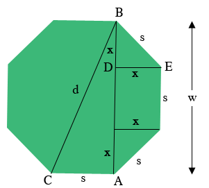

*Courtesy of Penny Nom [1]*

To determine the key dimensions of a regular octagon, we can derive equations based on the geometric properties of right triangles and isosceles triangles formed within the octagon.

### Diagonal Length  `d`

The diagonal of the octagon, denoted as `d`, can be found by considering the right triangle `ABC`, where `AB` is the width `w`, `BC` is the side length `s`, and `AC` is the diagonal `d`. Using the Pythagorean theorem:

### Width  `w` 

The width `w` is the distance from one side of the octagon to the opposite side, which is the length of one side `s` plus twice the length of segment `x`, the line from the midpoint of a side to the center of the octagon. Thus, `w` is expressed as:

### Segment Length  `x` 

The segment `x` lies within isosceles right triangles, such as triangle `EBD`. Since the octagon is regular, each of these triangles has two equal sides, which are the segments `x` and the side length `s`. By the Pythagorean theorem:

 

Substituting `x` into the width equation:

})
 
})

### AC Perpendicular Section
Now for the case of the rotated octagon we will need the length of the chord AC in the below diagram which we will refer to as `y`:

Given a regular octagon, we can find the length of chord `AC` and the perpendicular from the midpoint of `AC` to `B` as follows:

1. **Length of Chord `AC`:** The chord `AC` spans three sides of the octagon, so the angle `\theta` at the center of the octagon subtended by `AC` is `\theta = 3 \times 45^\circ = 135^\circ`.

Using the side length `s` of the octagon, the length of chord `AC` is given by the Law of Cosines:

}}})

Since `\cos(135^\circ) = -\frac{\sqrt{2}}{2}`, the expression simplifies to:

}})
 

2. **Perpendicular from Midpoint of `AC` to `B`:** Let `M` be the midpoint of `AC`, and `BM` is the perpendicular we want to find. Triangle `ABM` is an isosceles triangle with `AB = s` and `AM = \frac{AC}{2}`.

Using the Pythagorean theorem to solve for the height `h` (or `BM`):

^2&space;=&space;s^2}})

Substituting `AC` from above:

^2}}})
 
}{4}}}})
 
}{4}}}})
 
}}})
 

Therefore, the length of the perpendicular from the midpoint of `AC` to `B`, denoted as `h`, is:

And the length of the chord `AC`, denoted as `y`, is:

### Final Equations

Substituting `w` into the diagonal equation yields:

)^{2}})
 

With these equations, we can solve for the diagonal length `d`, width `w`, and segment `x` given the side length `s` of a regular octagon.

- **Diagonal `d`:** 
- **Width `w`:** })
- **Segment `x`:** 

## References:
[1] [mathcentral.uregina.ca 'quandaries & queries'](http://mathcentral.uregina.ca/QQ/database/QQ.09.20/h/sue2.html)
