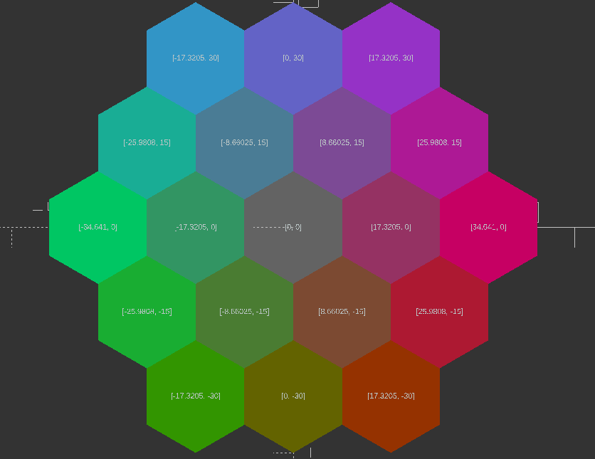
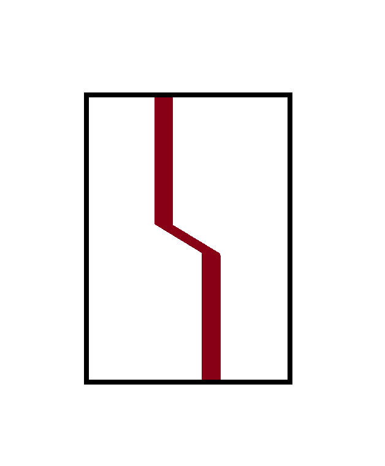

# Library Walkthrough
This serves as a walkthrough of the library including the concept and math behind it.

## Conceptual Overview
The idea is that we have two surfaces and we want to connect or fasten them together by adding geomtrically interlocking geometry to all or a portion of the surfaces such that applying a force normally (perpendicular) engages (snaps) the surfaces together. A similar method of fastening can be observed in velocro. The approach to creating this geometry herein consists of three main parts:
1. Tesselation of the position lattice,
2. Generation of the unit geometry,
3. Selective positioning of geometry onto lattice.

## Tess
*Tesselation of the position vector lattice*

The script is designed to calculate centers of hexagons and generate hexagonal patterns, optionally applying a color gradient. The mathematical logic and formulae involved are explained below.

**Hexagon Center Calculation**:
   - At the heart of the tesselation script is the calculation for the centers of the hexagons which make up the tesselation pattern. It supports generating hexagons using two different approaches:
     - rectilinear grid  
     - "levels" based approach where hexagons are added in concentric levels around a central hexagon.
The result is a list of 3D points where each datum represents the center point of a single hexagon: [[x0,y0,z0],[x1,y1,z1]...[xk-1,yk-1,zk-1]]. The value of `n` is the number of points in the list, for the rectilinear case this is straight forward as it is simply the value of `n * m` of the input grid. The concentric case is given by `H(L) = 3L^2 - 3L + 1`, the derivation for which is given in [Growth Rate of Hexagonal Pattern](#growth-rate) section below.
   - The key parameters for hexagon center calculation include the `radius` of the hexagon, `levels` for concentric hexagon generation, and optional `spacing` and grid dimensions `(n, m)` for rectangular arrangements.

1. **Mathematical Relations**:
   - **Offset Calculation**:
     - The offsets for x and y coordinates (`offset_x` and `offset_y`) are calculated using trigonometric functions based on the hexagon's radius.
       })
       })
     - These offsets are used to position the hexagons correctly in a grid, ensuring that each hexagon is placed with edges touching but not overlapping.

   - **Center Shift for Levels**:
     - For generating hexagons in levels around a central point, the script calculates a shift in the x-axis (`dx`) to center the hexagons. This shift is based on the number of levels and the x-offset.
       &space;\cdot&space;offset_x&space;\cdot&space;2})

2. **Color Gradient**:
   - Optionally, a color gradient can be applied to the hexagons based on their normalized position within the pattern. This involves calculating the minimum and maximum x and y coordinates of the centers to normalize each center's position.
   - The normalized positions are then used to determine the color of each hexagon if a color scheme is provided, allowing for a gradient effect across the pattern.

### Why Hexagons?
For a polygon to be tessellable, it must satisfy certain conditions:

1. **Regular Polygons**: A regular polygon can tessellate if its interior angle, when multiplied by a certain number, sums up to 360 degrees. This applies to triangles, squares, and hexagons.

   - The formula for the interior angle is: 
     - &space;\times&space;180^\circ&space;/&space;n})
   - For tessellation, the result must divide evenly into 360 degrees.

2. **Irregular Polygons**: Can tessellate if they can fit together without gaps or overlaps. This often requires a combination of different shapes or orientations, and in the present application hence multiple or increasingly complex geometry.

3. **Vertex Configuration**: For complex tessellations, especially with multiple polygons, each vertex configuration must be identical.

4. **Edge Compatibility**: Edges must be compatible in length and angle to fit together without gaps.

Triangles:
- 6 triangles form a hexagon, redundant; despite being more simple and elementary it makes the interation with the unit geometry

Squares:
- A technically valid solution
- No offset
  - Decreased oacking density
  - Concentration of shear forces

Hexagons:
- 

### Growth Rate of Hexagonal Pattern {#growth-rate}

The growth rate of the hexagonal pattern in the concentric case is defined by the number of hexagons added at each new level. Let \( L \) be the level number, with \( L = 1 \) representing the central hexagon. Let \( H(L) \) be the total number of hexagons at level \( L \).

For the first level:

&space;=&space;1})

For each subsequent level, 6 more hexagons are added for each side of the hexagon formed in the previous level:

&space;=&space;6(L&space;-&space;1)})

The total number of hexagons at any level \( L \) is the sum of hexagons up to that level:

&space;=&space;1&space;&plus;&space;\sum_{i=2}^{L}&space;6(i&space;-&space;1)})

Simplifying the sum using the formula for the sum of the first \( n \) natural numbers:

}{2}})

We apply this to our sum:

&space;=&space;1&space;&plus;&space;6&space;\left(&space;\frac{(L-1)L}{2}&space;\right)})

Expanding the equation:

&space;=&space;1&space;&plus;&space;3L(L&space;-&space;1)})

Finally, we get the quadratic formula representing the total number of hexagons at level \( L \):

&space;=&space;3L^2&space;-&space;3L&space;&plus;&space;1})

This formula indicates a quadratic growth rate with respect to the number of levels.

## Unit Geometry

The unit geometry refers to how the surface is bisected from +y to -y to form the latching structure of to fix the position of the +y and -y faces. The simplest example is given in the below figure.

Adding a tolerance on this line:

Looking forward we can also remove the upper edge where the now separate surfaces will make initial contact during engagement:

The surface to be bisected must consider leaving sufficient substrate on the +y and -y for each of the surfaces to remain intact during manufacturing. In the above example there is symmetry, so it is arbitrary to specify which segment will occupy the center points or the vertices but if it isn't then this detail becomes relevant how the bisection is defined with respect to +y and -y depending on the application of what occupies that space.